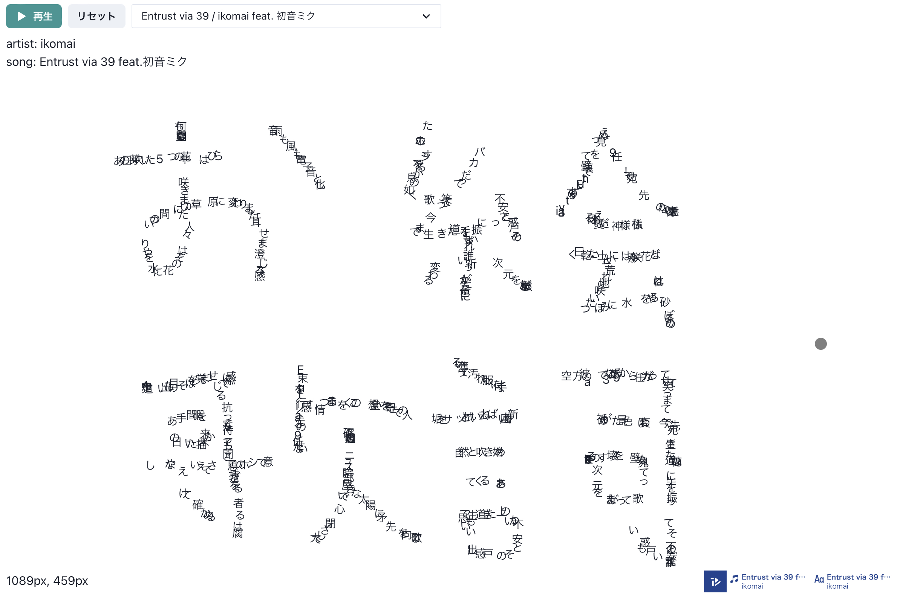

# oe-kashi | お絵歌詞

[](https://github.com/nemuki/negi/actions/workflows/ci.yml)



[初音ミク「マジカルミライ 2023」 プログラミング・コンテスト](https://magicalmirai.com/2023/procon/) 応募作品

歌詞で一筆書きの絵を描ける。二次創作に繋げたい。

- 黒いマウスストーカーの位置に歌詞が表示されます。
- 画面の解像度がキャンバスサイズになります。
- 楽曲選択のセレクトボックスから選択すると表示されている歌詞はリセットされます。

main ブランチデプロイ先: <https://oe-kashi.pages.dev>

## 推奨動作環境

- PC
  - Google Chrome 最新版
- iOS, iPad OS
  - Safari 最新版
- Android
  - Google Chrome 最新版

## 開発ビルド

[Volta](https://volta.sh/) を使用して Node.js のバージョンを管理しています。

### 1. クローン

```shell
git clone https://github.com/nemuki/oe-kashi.git
cd oe-kashi
```

### 2. `.env` 作成

`{YOUR_TOKEN}` の部分は置き換えてください

```shell
echo 'VITE_TEXT_ALIVE_APP_API_TOKEN={YOUR_TOKEN}' > .env
```

### 3. pnpm のインストール && 依存関係インストール

```shell
volta install pnpm
pnpm install
```

### 4. 開発サーバー立ち上げ

```shell
pnpm dev
```

## 本番ビルド

開発ビルドの手順 `1. ~ 3.` を行った後に以下を実行してください。 実行後、`dist/` 内にビルドファイルが生成されます。

```shell
pnpm build
```

## TextAlive App API

[](https://textalive.jp/)

TextAlive App API は、音楽に合わせてタイミングよく歌詞が動く Web アプリケーション（リリックアプリ）を開発できる JavaScript 用のライブラリです。

TextAlive App API について詳しくは Web サイト [TextAlive for Developers](https://developer.textalive.jp/) をご覧ください。
